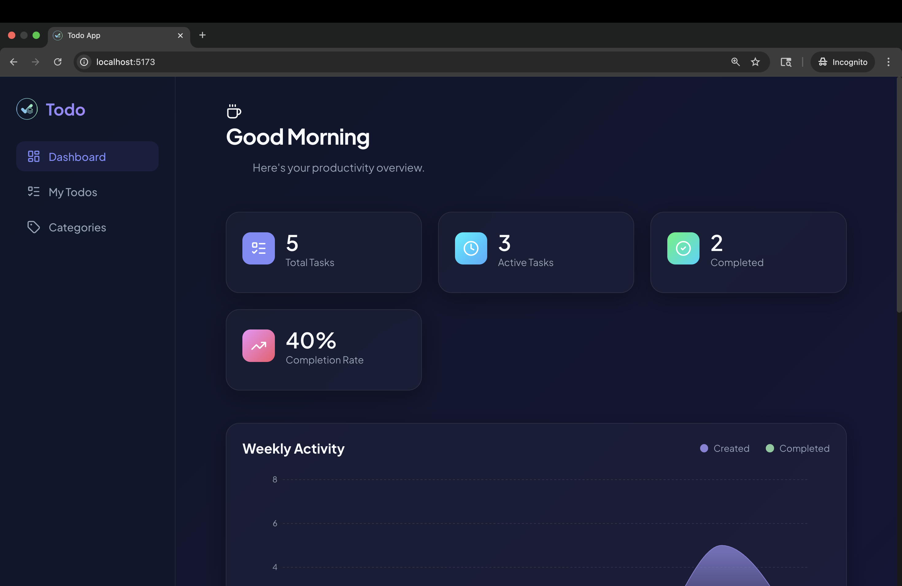
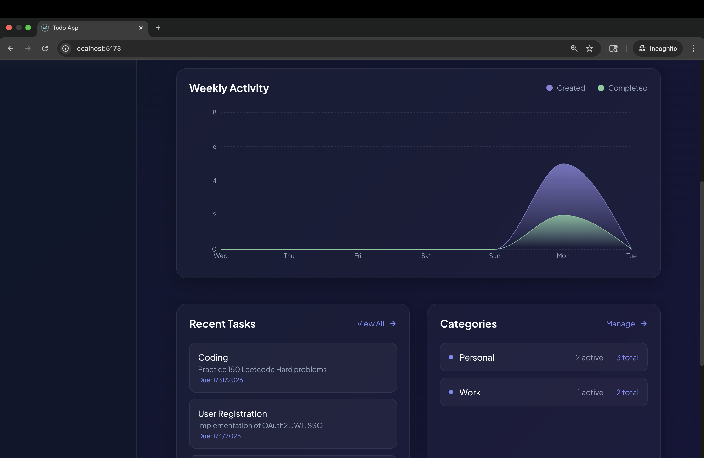
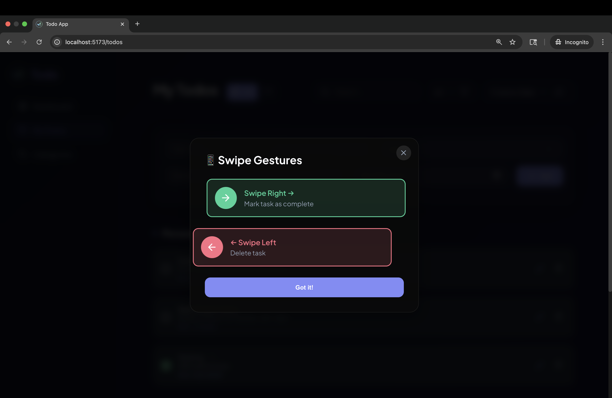
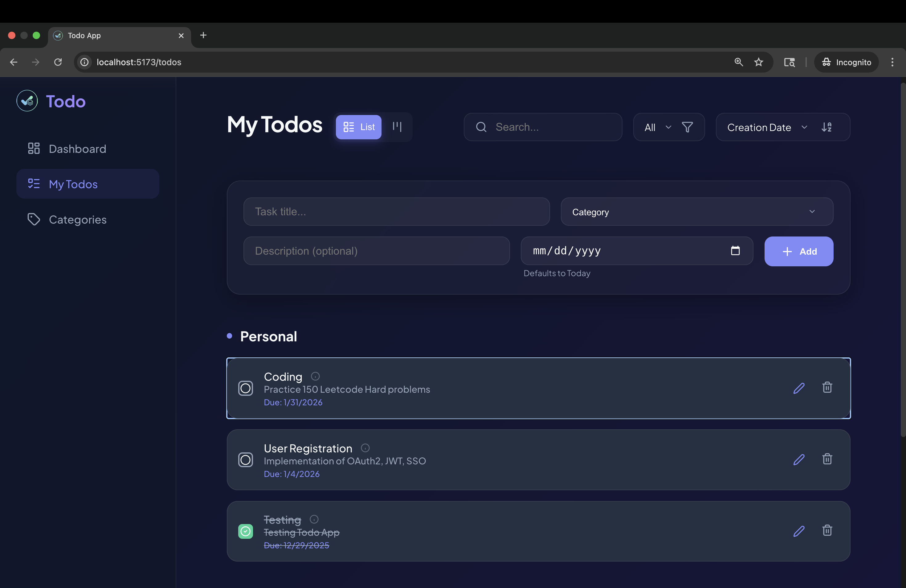
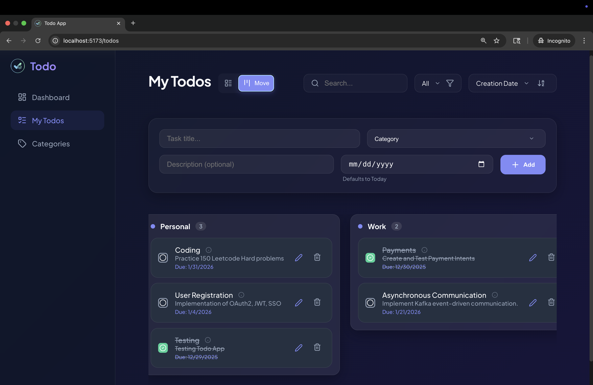
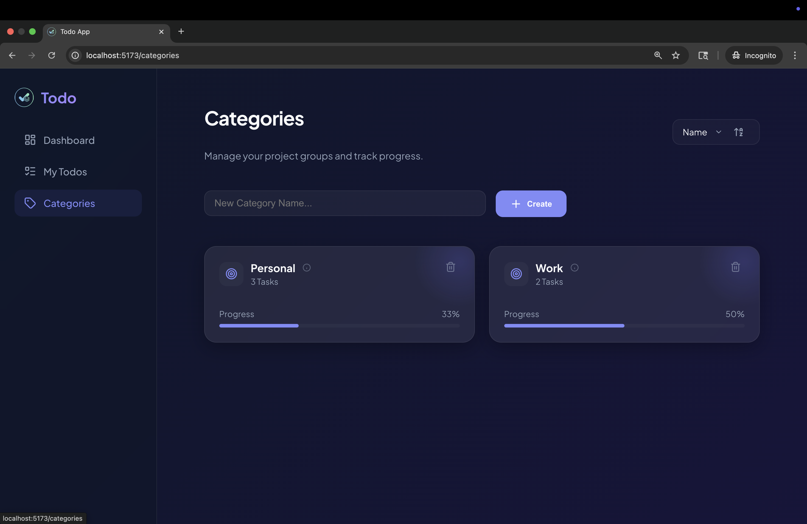
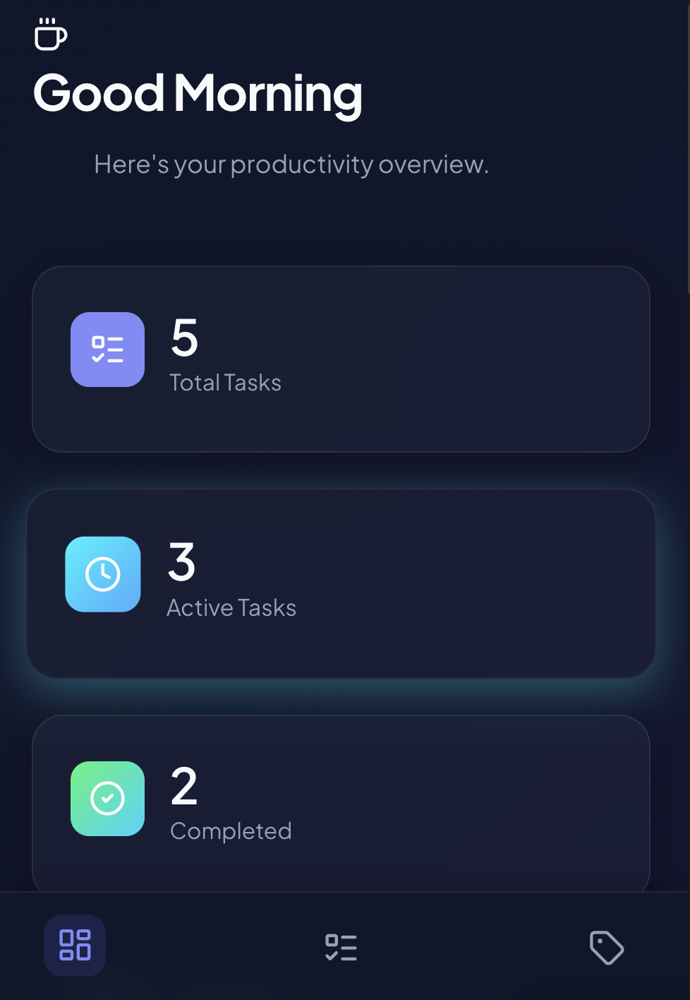
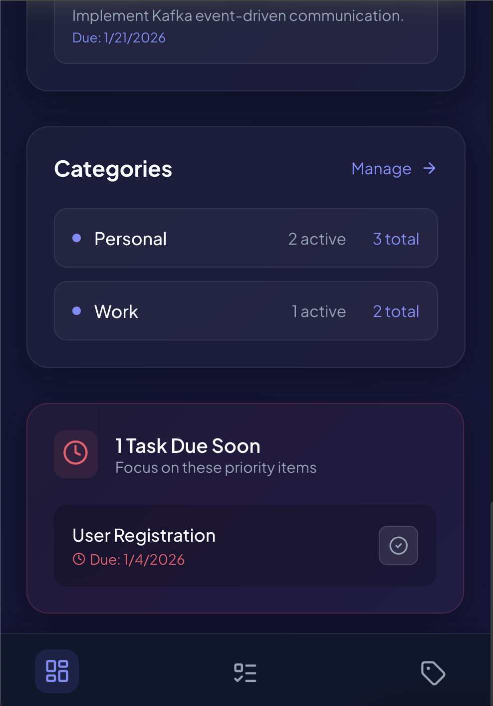
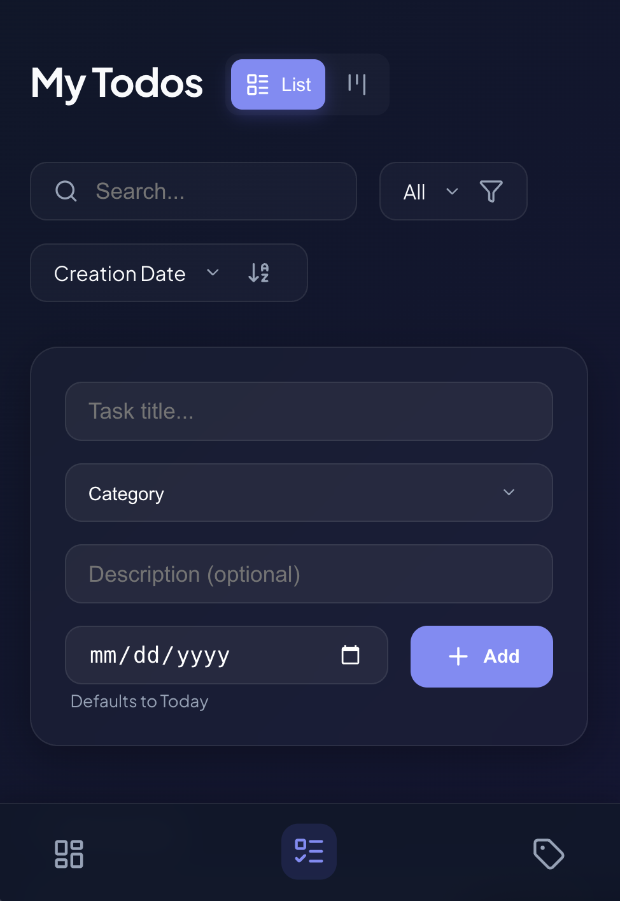
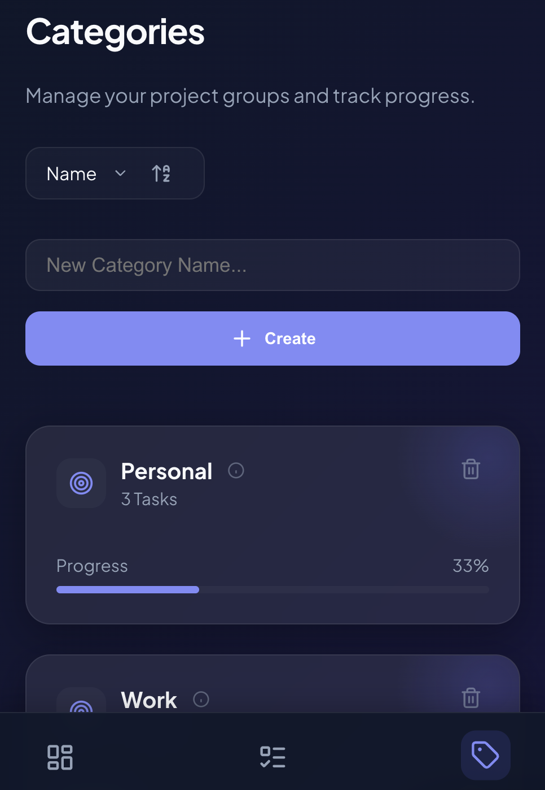

# Modern Todo Application

[](https://www.gnu.org/licenses/agpl-3.0)

A full-stack Todo application built with React, TypeScript, and Express. Features a robust task management interface with sorting, filtering, categories, and a Kanban board view.

## 🚀 Features

### Core Functionality
- **Create, Read, Update, Delete (CRUD)** tasks
- **Categories**: Organize tasks into categories (Work, Personal, etc.)
- **Sorting**: Sort by Creation Date, Due Date (Ascending/Descending)
- **Filtering**: View All, Active, or Completed tasks
- **Search**: Real-time search by task title

### Advanced Features
- **Dashboard**: High-level overview with statistics, charts, and "Due Soon" priorities
- **Dynamic Greetings**: Smart time-based greeting (Good Morning/Afternoon/Evening)
- **Views**: Toggle between List View and Kanban Board View
- **Drag & Drop**: Reorder tasks and move them between categories in Board view
- **Responsive Design**: Mobile-friendly with swipe gestures (Swipe left to delete, right to complete)
- **Glassmorphism UI**: Modern aesthetic with a custom CSS loading spinner and smooth animations
- **Polished UX**: Consistent "Chip" design for filtering/sorting across all pages, improved focus visibility for keyboard users
- **Robust Validation**: Real-time error clearing for task forms and stricter title/category validation

## 🛠 Tech Stack

### Frontend
- **Framework**: React 18 + Vite
- **Language**: TypeScript
- **State Management**: Redux Toolkit (RTK) + RTK Query
- **Routing**: React Router DOM v6
- **Styling**: Vanilla CSS with CSS Variables (Modern Glassmorphism theme)
- **Icons**: Lucide React
- **Animations**: Framer Motion
- **Drag & Drop**: dnd-kit
- **Charts**: Recharts (for activity visualization)

### Backend
- **Runtime**: Node.js
- **Framework**: Express.js
- **Language**: TypeScript
- **Database**: In-memory JSON storage (persistence via `data.json`)
- **Validation**: Zod (Shared schemas)

## 📂 Project Structure

```
Todo/
├── frontend/         # React application
│   ├── src/
│   │   ├── features/ # Redux slices & feature components
│   │   ├── pages/    # Main route pages (Dashboard, MyTodos, etc.)
│   │   └── components/
├── backend/          # Express API server
│   ├── src/
│   │   ├── controllers/
│   │   ├── routes/
│   │   └── models/
│   └── data.json     # JSON database
└── shared/           # Shared types and Zod schemas
```

## ⚡️ Getting Started

### Prerequisites
- Node.js (v16+)
- npm

### Installation

1. **Clone the repository**
   ```bash
   git clone https://github.com/BhashampallyPrudhviRaj/Todo.git
   cd Todo
   ```

2. **Install Backend Dependencies**
   ```bash
   cd backend
   npm install
   ```

3. **Install Frontend Dependencies**
   ```bash
   cd ../frontend
   npm install
   ```

### Running the Application

You need to run the backend and frontend in separate terminals.

**Terminal 1: Backend**
```bash
cd backend
npm run dev
# Server runs on http://localhost:3000
```

**Terminal 2: Frontend**
```bash
cd frontend
npm run dev
# App runs on http://localhost:5173
```

## 🧪 Development

- The backend uses `nodemon` for hot reloading.
- The frontend uses Vite HMR for instant feedback.
- Shared types in `shared/` are used by both workspaces.

## 📱 Mobile Gestures

- **Swipe Right**: Mark task as completed
- **Swipe Left**: Delete task

## 🎨 UI/UX Highlights

- **Custom Logo**: Professional branding with custom favicon and sidebar logo
- **Activity Charts**: Visual representation of task completion trends
- **Smart Dashboard**: Real-time statistics with color-coded metrics
- **Due Soon Widget**: Prioritizes tasks due within the next 7 days
- **Keyboard Accessible**: Full keyboard navigation support
- **Loading States**: Custom CSS spinner for better UX

## 🌐 API Endpoints

### Todos
- `GET /api/todos` - Get all todos
- `GET /api/todos/:id` - Get a single todo by ID
- `POST /api/todos` - Create a new todo
- `PUT /api/todos/:id` - Update a todo
- `PUT /api/todos/reorder` - Reorder todos (Kanban support)
- `DELETE /api/todos/:id` - Delete a todo

### Categories
- `GET /api/categories` - Get all categories
- `POST /api/categories` - Create a new category
- `DELETE /api/categories/:id` - Delete a category

## 🔧 Environment Variables

### Frontend
Create a `.env` file in the `frontend` directory:
```env
VITE_API_URL=http://localhost:3000
```

### Backend
No environment variables required for local development. For production, consider adding:
```env
PORT=3000
NODE_ENV=production
```

## 📸 Screenshots

### Desktop Views

#### Dashboard Overview
<div align="center">
  
  
</div>

#### Swipe Gestures


#### My Todos - List View


#### Kanban Board View


#### Categories Management


### Mobile Views

<div align="center">
  
  
  
  
</div>

## 🤝 Contributing

Contributions are welcome! Please feel free to submit a Pull Request.

## 📝 License

This project is open source and available under the [GNU Affero General Public License v3.0](LICENSE).

## 👨‍💻 Author

**Prudhvi Raj Bhashampally**

Built with ❤️ using modern web technologies

---

**Note**: This application uses in-memory JSON storage. For production use, consider integrating a proper database like MongoDB, PostgreSQL, or Firebase.
